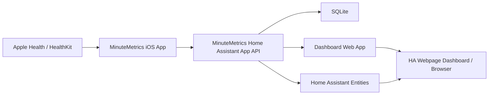

# System Architecture

## Overview

MinuteMetrics has four layers:

1. Apple Health data on each participant's iPhone.
2. MinuteMetrics iOS app for HealthKit reads and sync.
3. MinuteMetrics Home Assistant app for storage, aggregation, API, and dashboard hosting.
4. Home Assistant entities and dashboard presentation.

## Data Flow

- Each participant installs the iOS app.
- The administrator creates a participant record and sync token in the Home Assistant app.
- The participant pairs the app using a setup URL, QR code, or manual token entry.
- The iOS app requests HealthKit permission for Exercise Minutes.
- On app launch, manual sync, and background refresh, the app sends daily Exercise Minutes totals for the configured date range.
- The Home Assistant app resolves the participant from the sync token and upserts daily totals by participant and date.
- The Home Assistant app calculates totals, leader, margin, trends, projections, and stale-sync indicators.
- The dashboard and Home Assistant sensors read from the app's aggregate state.

## Accuracy Strategy

- Use HealthKit `HKQuantityTypeIdentifier.appleExerciseTime`.
- Query with `HKStatisticsCollectionQuery` and `cumulativeSum` using day boundaries in the participant's local calendar.
- Sync daily totals, not just current yearly total.
- Support full-period resync to account for Health app edits, delayed workout processing, restored watch data, or source changes.
- Store the sync timezone and query window used by the app.

## Privacy Strategy

- The app requests read-only access to Exercise Minutes.
- The app does not need workouts, heart rate, location, calories, contacts, or Apple ID data.
- The Home Assistant app stores daily minute totals and sync metadata only.
- Tokens can be revoked per participant.

## Configuration Model

Configurable values:

- Competition name.
- Start date.
- End date.
- Participants.
- Participant display name.
- Participant color.
- Participant token.
- Optional Home Assistant user ID.
- Optional Home Assistant person entity ID.
- Optional Home Assistant sensor publishing method.
- Dashboard visibility and theme.

No participant identity should be hardcoded in source code. MinuteMetrics participant IDs are the stable identity. Home Assistant user/person links are optional metadata used for convenience features such as avatars, display hints, permissions, or filtering.

## Delivery Order

1. API and data model.
2. iOS HealthKit proof of accuracy.
3. Home Assistant app with local dashboard.
4. Home Assistant entities.
5. Packaging and public setup docs.
